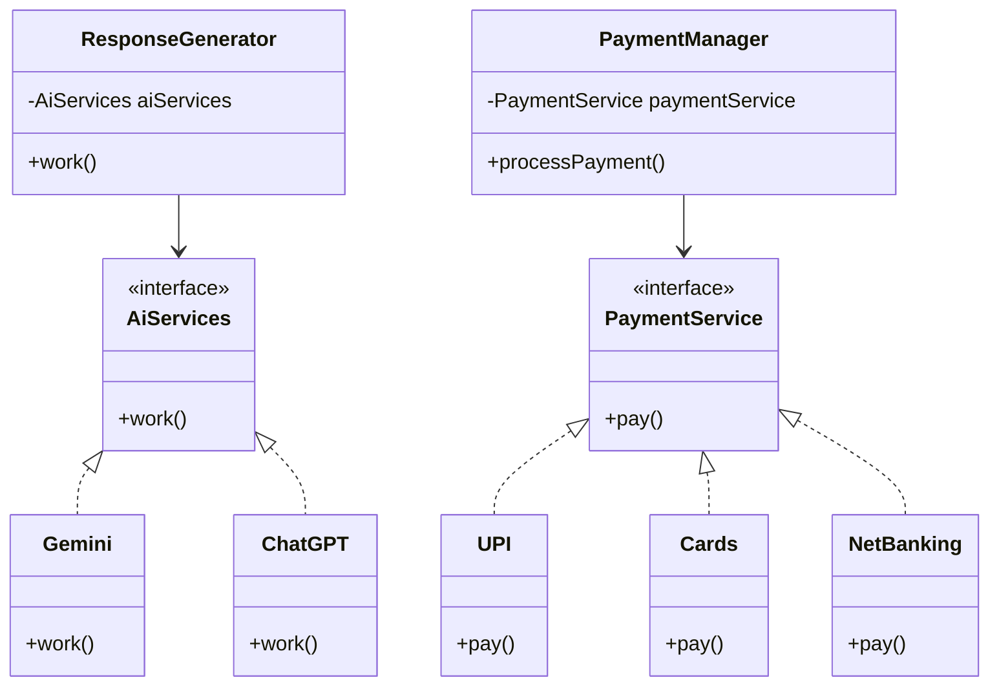

# EasyBasket

A Spring Boot project demonstrating Dependency Injection and externalized configuration with two real-world-inspired modules — AI Services and Payment processing.

## Overview

**EasyBasket** is a Spring Boot 3.2.0 demonstration project that showcases two core Spring Framework concepts:

1. **Dependency Injection (DI)** — wiring multiple implementations of the same interface using `@Qualifier` and `@Primary`
2. **Externalized Configuration** — injecting values from `application.properties` using `@Value`

The project is structured around two modules: an **AI Services** module and a **Payment** module, both demonstrating the same DI patterns.

## Architecture



## Tech Stack / Prerequisites

| Requirement  | Version                       |
| ------------ | ----------------------------- |
| Java (JDK)   | 17 or higher                  |
| Apache Maven | 3.6+                          |
| Spring Boot  | 3.2.0 (managed via `pom.xml`) |

> No database, no external API keys, no Docker required — this is a pure Spring DI demo.

## Project Structure

The package layout under `src/main/java/com/codespace/EasyBasket/`:

| File                         | Role                                                                                  |
| ---------------------------- | ------------------------------------------------------------------------------------- |
| `EasyBasketApplication.java` | Entry point — bootstraps Spring context and triggers both modules                     |
| `AiServices.java`            | Interface for AI service implementations                                              |
| `Gemini.java`                | `@Primary` AI service; reads `country`, `isActive`, `listOfValues` from config        |
| `ChatGPT.java`               | Secondary AI service; used explicitly via `@Qualifier("chatgptModel")`                |
| `ResponseGenerator.java`     | Consumer of `AiServices`; wired to ChatGPT via `@Qualifier`                           |
| `PaymentService.java`        | Interface for payment implementations                                                 |
| `UPI.java`                   | `@Primary` payment service; reads `merchantId`, `isPaymentActive`, `supportedUpiApps` |
| `Cards.java`                 | Card payment implementation                                                           |
| `NetBanking.java`            | Net banking implementation; wired into `PaymentManager` via `@Qualifier`              |
| `PaymentManager.java`        | Consumer of `PaymentService`; wired to NetBanking via `@Qualifier`                    |

## Configuration (`application.properties`)

**AI Module**
- `EasyBasket.country` — Country context (default: `India`)
- `EasyBasket.isActive` — Feature flag for AI module (default: `true`)
- `EasyBasket.listOfValues` — Comma-separated list of sample values (default: `val1,val2,val3`)

**Payment Module**
- `EasyBasket.merchantId` — Merchant identifier (default: `MERCHANT_001`)
- `EasyBasket.isPaymentActive` — Feature flag for payment module (default: `true`)
- `EasyBasket.supportedUpiApps` — Comma-separated list of supported UPI apps (e.g., `GPay,PhonePe,Paytm`)

## How It Works

1. Spring Boot starts and scans all `@Component`, `@Service` beans.
2. `ResponseGenerator` is injected with `ChatGPT` (via `@Qualifier("chatgptModel")`), even though `Gemini` is `@Primary`.
3. `PaymentManager` is injected with `NetBanking` (via `@Qualifier("netBankingPayment")`), even though `UPI` is `@Primary`.
4. `main()` calls `rg.work()` → prints ChatGPT output, then `pm.processPayment()` → prints NetBanking output.
5. `@Value` fields in `Gemini` and `UPI` are populated from `application.properties` at startup.

## Installation & Running

**Clone the repository**
```bash
git clone https://github.com/Guntupalli-Sabarish/24-03-26.git
cd 24-03-26
```

**Build the project**
```bash
mvn clean install
```

**Run the application**
```bash
mvn spring-boot:run
```

or run the generated JAR:
```bash
java -jar target/EasyBasket-0.0.1-SNAPSHOT.jar
```

**Expected console output**
```text
Processing with ChatGPT.
Processing net banking payment.
```

**Alternate output (changing `@Qualifier` to `"upiPayment"` in `PaymentManager`)**
```text
Processing with ChatGPT.
Processing UPI payment.
Merchant ID: MERCHANT_001
Payment Active: true
```

## Key Concepts Demonstrated

- `@Primary` — marks the default bean when multiple implementations exist.
- `@Qualifier` — overrides `@Primary` to inject a specific named bean.
- `@Value` — injects scalar values and comma-separated lists from `application.properties`.
- `ApplicationContext` — manual bean retrieval in `main()` to trigger both modules.

## Customization

To switch the active AI or payment provider, change the `@Qualifier` string in `ResponseGenerator` or `PaymentManager`. For example, removing the `@Qualifier` annotation will make Spring fall back to injecting the `@Primary` bean natively.

## License

MIT License
